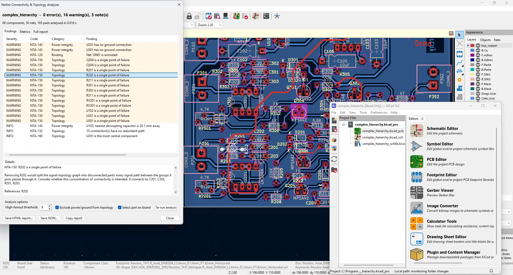
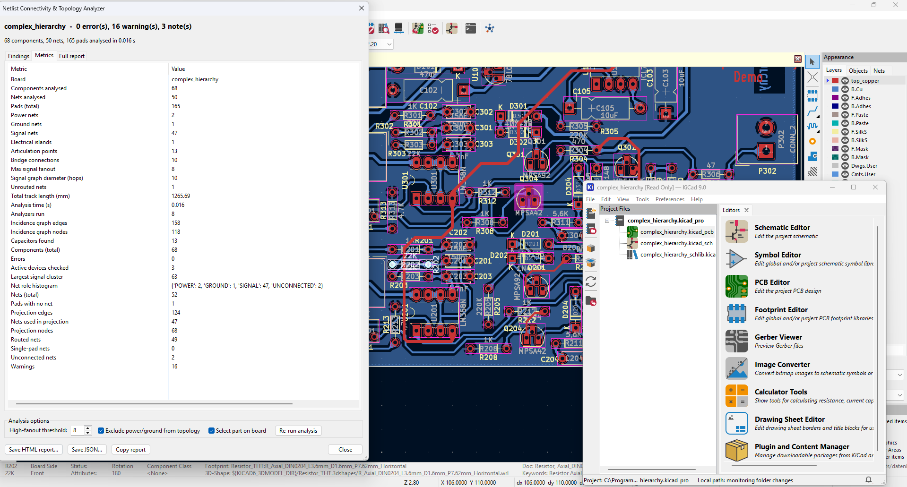
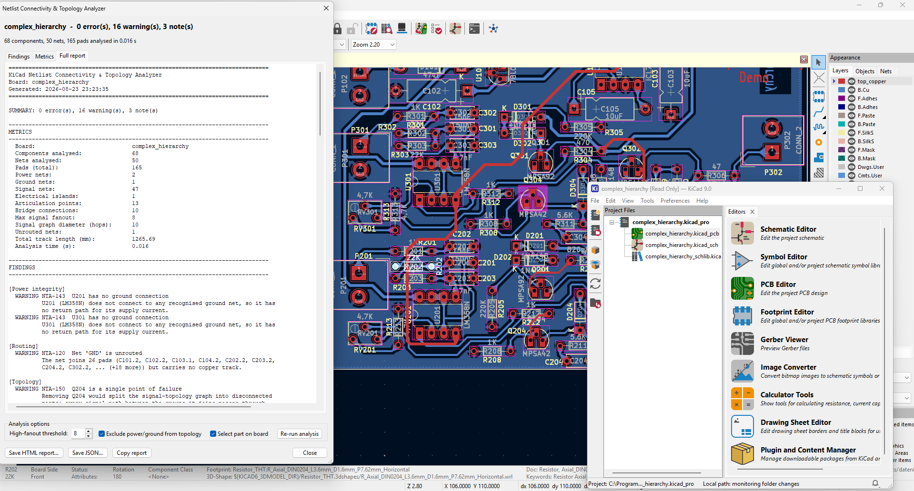
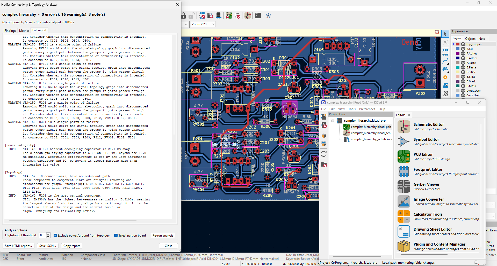
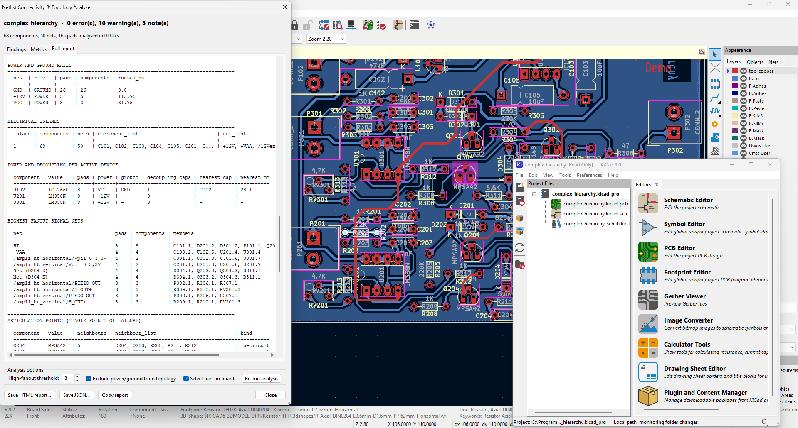
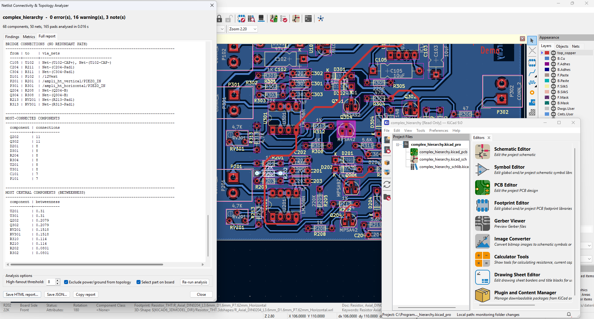

# KiCad Netlist Connectivity & Topology Analyzer

A KiCad 9 action plugin that models a board's netlist as a graph and applies
graph-theoretic analysis to surface connectivity and topology problems that
KiCad's own DRC and ERC do not look for.

*FOSSEE eSim Semester-Long Internship, Autumn 2026 — Submission Task 6.*

---

## What it does

DRC and ERC are local checks: they ask whether a given pad, track or pin pair is
legal. This plugin asks global questions about the netlist's shape instead.

- **Has the board split into disconnected electrical islands?** An edit that
  detaches a sub-circuit passes DRC cleanly.
- **Which single component would break the most signal paths if it failed?**
  Articulation points and bridges in the signal topology.
- **Which nets carry enough loads to degrade their edge rates?** Each load adds
  input capacitance and a stub.
- **Does every substantial IC have decoupling on the correct rail *and* ground?**
  A capacitor on a different rail decouples nothing, however close it sits.
- **Which nets are declared but carry no copper, or reach only one pad?**

Output is a ranked list of findings — each with the physical consequence spelled
out — plus board metrics and a topology diagram.

## Quick start (no KiCad needed)

```bash
git clone https://github.com/Official-HarshitAgarwal/kicad-netlist-topology-analyzer.git
cd kicad-netlist-topology-analyzer

# Analyse the bundled demo board
python -m netlist_topology_analyzer.cli examples/demo_board.json

# Write a self-contained HTML report
python -m netlist_topology_analyzer.cli examples/demo_board.json --html report.html

# Run the test suite (288 tests, well under a second)
python -m unittest discover -s tests -t .
```

To try it as an actual plugin, generate a real board and open it in KiCad. Run
this from *Tools → Scripting Console* in the PCB editor, since it needs KiCad's
own Python:

```python
exec(open(r"examples/make_kicad_board.py").read())
```

That writes `examples/demo_board.kicad_pcb` — 38 footprints, 33 nets, one seeded
defect per analyzer. The circuit is defined once in `examples/make_demo_board.py`
and both emitters read it from there, so the openable board and the JSON test
fixture are the same netlist by construction. See
[docs/INSTALL.md](docs/INSTALL.md#regenerating-the-demo-board) for details.

Requires Python 3.8+ and nothing else. No `pip install`, no third-party packages.

## Install into KiCad 9

Copy or symlink the `netlist_topology_analyzer/` directory into KiCad's plugin
folder, then *Tools → External Plugins → Refresh Plugins*.

| OS | Plugin folder |
| --- | --- |
| Windows | `<Documents>\KiCad\9.0\3rdparty\plugins\` — see the note below |
| Linux | `~/.local/share/kicad/9.0/3rdparty/plugins/` |
| macOS | `~/Documents/KiCad/9.0/3rdparty/plugins/` |

On Windows, `<Documents>` is `C:\Users\<you>\OneDrive\Documents` whenever
OneDrive is backing up that folder, **not** `%USERPROFILE%\Documents`. Copying
to the wrong one fails silently — KiCad never reads it and never says so. The
PowerShell snippet in [`docs/INSTALL.md`](docs/INSTALL.md) resolves this for you.

The exact path is also shown in KiCad under *Preferences → Preferences → Paths*, or
run `pcbnew.PLUGIN_DIRECTORIES_SEARCH` in the scripting console. Full
step-by-step instructions, including verification and troubleshooting, are in
[`docs/INSTALL.md`](docs/INSTALL.md).

Once installed, open a board and choose **Tools → External Plugins → Netlist
Connectivity & Topology Analyzer**, or click its toolbar button.

## Using the dialog

Three tabs: **Findings** (with a detail pane explaining each one), **Metrics**,
and the **full text report**. Selecting a finding selects and zooms to the
referenced footprint in the PCB editor.

Two live controls, both with a **Re-run analysis** button:

- **High-fanout threshold** — move it to test whether a warning is real for your
  design.
- **Exclude power/ground from topology** — leave it ticked. Unticking it
  demonstrates why: rails connect nearly every part, so including them makes the
  component graph almost complete, and the topology analysis then has nothing
  left to say. See [`docs/DESIGN.md` §4.2](docs/DESIGN.md).

Export buttons write a self-contained HTML report (inline CSS and SVG, opens
offline) or JSON.

## Screenshots

<p align="center">
  
  
  
  
  
  
  
</p>

## Command line

```
python -m netlist_topology_analyzer.cli BOARD.json [options]

  --html PATH            write an HTML report
  --json PATH            write the JSON result
  --text PATH            write the text report
  --quiet                do not print to stdout
  --no-sections          omit detail tables from the text report
  --analyzers NAMES      comma-separated subset (see --list-analyzers)
  --fanout-threshold N   override the high-fanout threshold
  --include-rails        keep power/ground in the projection (for demonstration)
  --fail-on {never,error,warning}
  --list-analyzers
```

Exit codes: `0` success, `1` findings at or above `--fail-on`, `2` usage error —
so the analysis can gate a CI pipeline:

```bash
python -m netlist_topology_analyzer.cli board.json --quiet --fail-on error
```

JSON output is deterministic, so two board revisions can be diffed to see which
findings a change introduced or fixed.

The CLI reads a board snapshot in JSON form. To produce one from a live board,
run this in KiCad's scripting console:

```python
from netlist_topology_analyzer.core.board_extractor import extract_board
open("board.json", "w").write(extract_board().to_json())
```

## The analyzers

| Analyzer | Codes | Reports |
| --- | --- | --- |
| `statistics` | — | Component/net/pad inventory, rail census, routed length |
| `islands` | NTA-100, 101 | Disconnected sub-circuits; components with no nets |
| `floating_nets` | NTA-110–112 | Nets reaching one pad or none |
| `unrouted` | NTA-120–122 | Multi-pad nets with no copper |
| `fanout` | NTA-130 | High-fanout signal nets, escalating with load count |
| `power` | NTA-140–145 | Rail inventory; missing decoupling; capacitors too far away |
| `spof` | NTA-150–152 | Articulation points and bridges in the signal topology |
| `topology_metrics` | NTA-160, 161 | Betweenness centrality, diameter, hub ranking |

Ahead of all of them the engine emits **NTA-001** if the board has no footprints
and no nets at all, and skips the rest — an empty board is an absence of input,
not a design with problems, and reporting it as the latter sends you chasing a
configuration bug that isn't there.

Every threshold and net-name pattern lives in
`netlist_topology_analyzer/core/config.py`, including house-style rail names.

## Repository layout

```
netlist_topology_analyzer/
├── __init__.py            registers the plugin with KiCad
├── action_plugin.py       pcbnew.ActionPlugin entry point
├── cli.py                 head-less runner
├── core/
│   ├── board_extractor.py the ONLY module that imports pcbnew
│   ├── model.py           BoardData / Component / Net / Pad / Finding
│   ├── config.py          thresholds and net-name patterns
│   ├── classifier.py      POWER / GROUND / SIGNAL / UNCONNECTED roles
│   ├── graph_model.py     bipartite incidence + component projection
│   ├── algorithms.py      union-find, Tarjan, Brandes, BFS (stdlib only)
│   ├── analyzers.py       the eight rules
│   ├── engine.py          orchestration
│   └── report.py          text / JSON / HTML / SVG writers
├── ui/results_dialog.py   wxPython dialog
└── resources/icon.png     toolbar icon

docs/    PROPOSAL.md · DESIGN.md · INSTALL.md · PRESENTATION.md
tests/   288 unit tests, no KiCad required
examples/ demo_board.json + two emitters for one circuit
```

The organising constraint: **exactly one module imports `pcbnew`.** Everything
else is standard-library Python that has never heard of KiCad. That is what makes
the engine testable without KiCad and keeps the KiCad-facing surface small enough
to port when the SWIG API gives way to the IPC API.

## Documentation

- [`docs/PROPOSAL.md`](docs/PROPOSAL.md) — the proposal, and why this is both a
  Computer Science and an Electronics task
- [`docs/DESIGN.md`](docs/DESIGN.md) — architecture, data model, graph modelling
  decisions, algorithms and complexities, domain rules, verification
- [`docs/INSTALL.md`](docs/INSTALL.md) — installation, execution, troubleshooting
- [`docs/PRESENTATION.md`](docs/PRESENTATION.md) — demo outline

## License

MIT — see [`LICENSE`](LICENSE).
